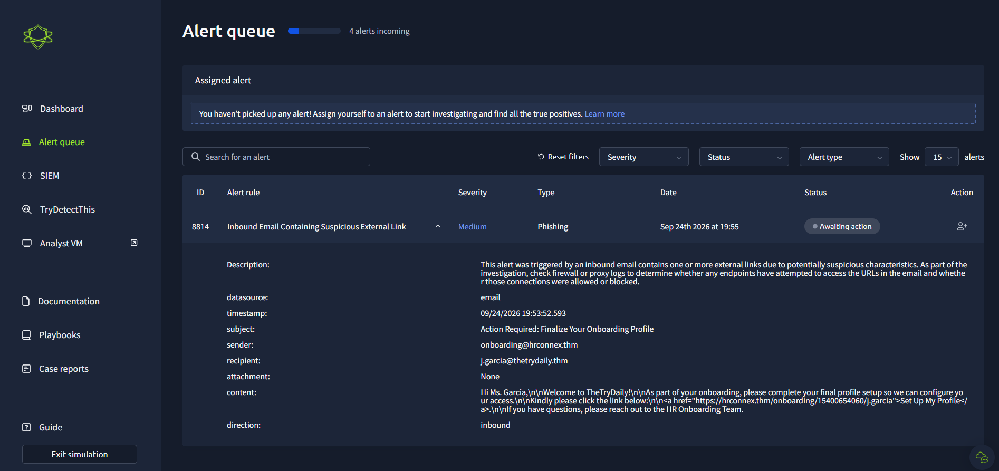
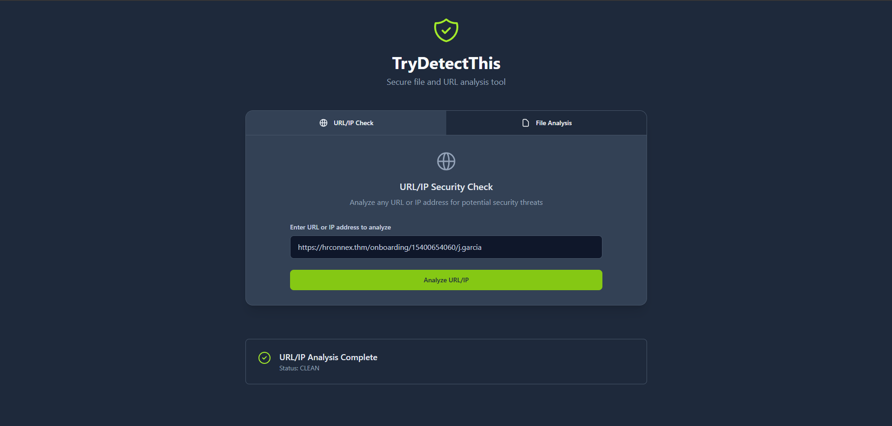
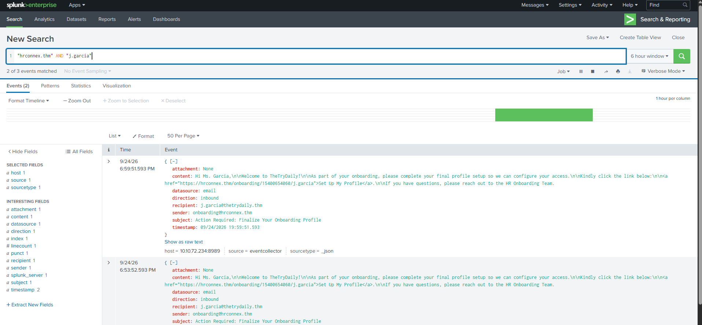
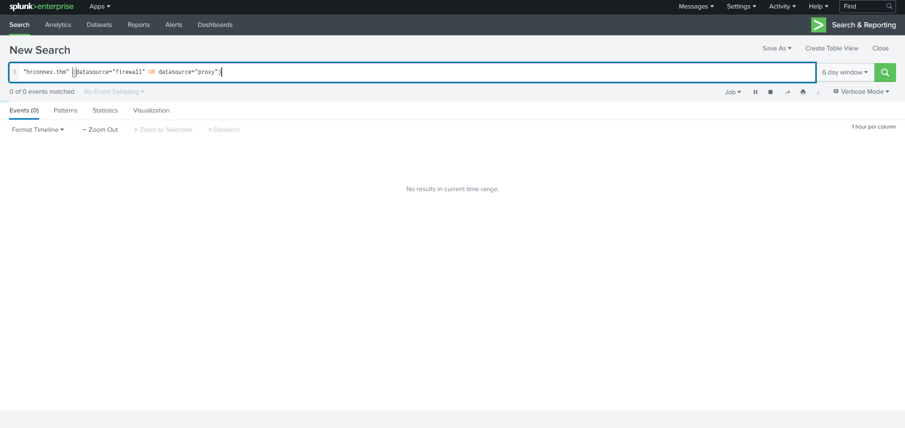
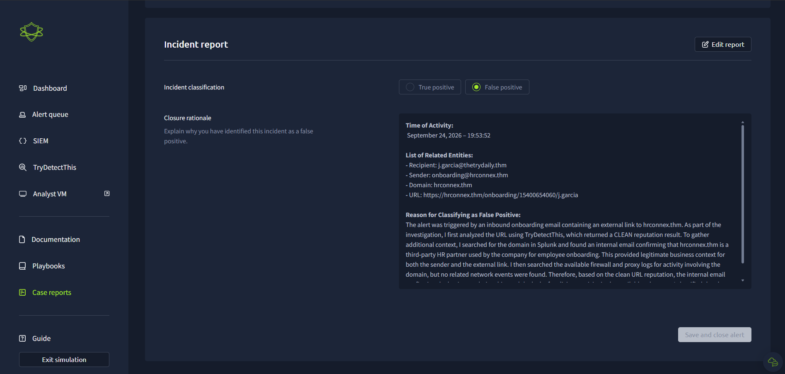

# SOC Alert Triage Investigation

## Overview

This project documents my investigation of a phishing-related security alert in a simulated SOC environment. The objective was to determine whether an inbound email containing an external link represented a real security threat or legitimate business activity.

During the investigation, I analyzed the alert, extracted and checked the external URL, correlated related events in Splunk, reviewed available network telemetry, and documented the evidence used to reach a final classification.

## Environment & Tools

- TryHackMe SOC simulation
- Splunk Enterprise
- TryDetectThis
- Email log analysis
- Firewall and proxy log analysis

## Scenario

A medium-severity phishing alert was triggered after an inbound email containing an external link was delivered to an employee. The email appeared to be related to employee onboarding and directed the recipient to an external HR website.

Rather than relying only on the alert classification, I investigated the URL, searched the SIEM for additional context, and reviewed the available network logs before determining whether the activity was malicious.


## Alert Details

| Field | Value |
|---|---|
| Alert ID | 8814 |
| Alert Rule | Inbound Email Containing Suspicious External Link |
| Severity | Medium |
| Incident Type | Phishing |
| Recipient | j.garcia@thetrydaily.thm |
| Sender | onboarding@hrconnex.thm |
| Subject | Action Required: Finalize Your Onboarding Profile |
| Attachment | None |
| External Domain | hrconnex.thm |

The alert was generated because the inbound email contained an external link with potentially suspicious characteristics. This required further investigation to determine whether the message represented a phishing attempt or legitimate business communication.

### Initial Alert




## Investigation

### 1. URL Reputation Analysis

I began by extracting the external URL from the email and analyzing it with TryDetectThis. The purpose of this step was to determine whether the URL had been identified as malicious or associated with known threats.

The analysis returned a **CLEAN** reputation result. While this reduced the initial suspicion, I did not treat the result alone as enough evidence to close the alert. Additional context was still required to determine whether the email was legitimate.



### 2. SIEM Investigation and Context Validation

After checking the URL reputation, I searched Splunk for events related to `hrconnex.thm` to understand how the domain appeared elsewhere in the environment.

The search returned email events associated with the domain. During the review, I identified an internal email explaining that `hrconnex.thm` was a third-party HR partner used by the company for employee onboarding. This provided business context consistent with the onboarding message received by the user.

I then narrowed the search by correlating the domain with the recipient:

```spl
"hrconnex.thm" AND "j.garcia"
```

This helped confirm the relationship between the recipient and the onboarding communication.



### 3. Network Activity Analysis

To check for additional activity involving the external domain, I searched the available firewall and proxy telemetry in Splunk:

```spl
"hrconnex.thm" (datasource="firewall" OR datasource="proxy")
```

The search returned **no matching network events within the selected time window**. Therefore, I found no evidence in the available firewall or proxy telemetry showing network activity involving the domain.

Importantly, the absence of matching logs was treated as a lack of evidence rather than definitive proof that no interaction occurred.




## Findings

The investigation produced three key findings:

- The external URL was analyzed with TryDetectThis and returned a **CLEAN** reputation result.
- Splunk provided legitimate business context showing that `hrconnex.thm` was being used as a third-party HR partner for employee onboarding.
- No firewall or proxy events involving the domain were identified within the searched time window.

Taken together, the available evidence did not indicate malicious activity associated with the alert.

## Final Classification

**False Positive**

The alert was triggered as expected because the inbound email contained an external link. However, further investigation showed that the link was associated with a legitimate onboarding process.

The clean URL reputation, supporting internal email context, and lack of malicious activity in the available telemetry provided sufficient evidence to close the alert as a false positive.

### Case Report

The investigation and reasoning were documented in the SOC case report before the alert was closed.



## Skills Demonstrated

- SOC alert triage
- Phishing investigation
- SIEM log analysis with Splunk
- Event correlation
- URL reputation analysis
- Email analysis
- Firewall and proxy log investigation
- False-positive identification
- Incident documentation
- Evidence-based decision making

## Investigation Workflow

`Alert Triage` → `URL Analysis` → `SIEM Correlation` → `Network Log Analysis` → `Evidence Review` → `False Positive`

## Key Takeaway

This investigation reinforced the importance of validating alerts through multiple sources of evidence rather than relying on a single indicator. Although the alert was categorized as phishing and involved an external URL, additional investigation provided legitimate business context and no evidence of malicious activity was identified in the available telemetry.


